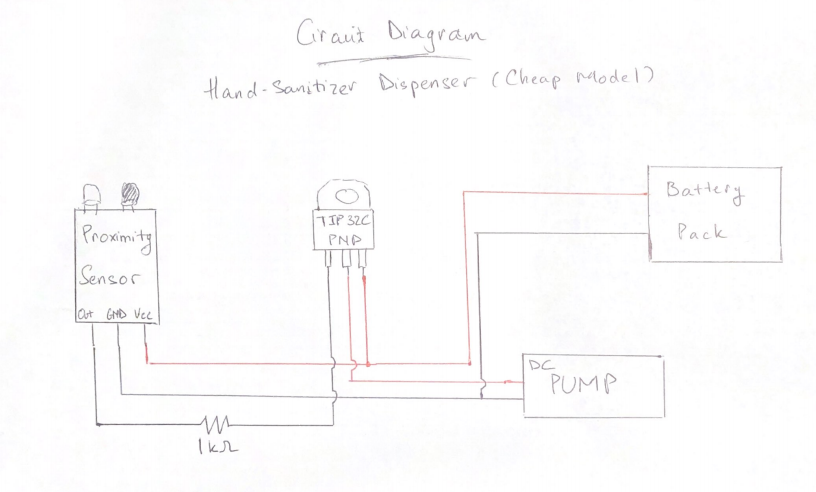

===============
Getting Started
===============

This is the **Hand-Sanitizer** *Getting started* page.

Project materials
-----------------

* IR distance sensor
* TIP32C Transistor
* 1 kOhm resistor
* DC submersible pump + tubing
* 4 AA battery pack
* 8.2 oz pour spout bag
* PLA filament

Production Dimension for Design Specifications
----------------------------------------------
*Resistor: Body Size:4.0±0.5 mm x 11.0±1.0 mm;
*Battery pack: 7.28 x 5.75 x 2.56 inches
*Screws: Size (L x Dia.): approx. 5 x 2.8mm
*IR distance sensor: board size: 3.2CM * 1.4CM
*TIP transistor: 9.15 x 10.4 x 4.6mm
*Pouch: Capacity: 1.75 fluid ounces, Spout Inner Dia 0.32", Size: 2 3/4"W x 4"H x 1 1/2"D
*Motor length : 4.5cm , width: 2.5cm

Links to introductions
**********************

* `Hand Sanitizer Demo Video <https://drive.google.com/file/d/1qxCrOML6oVoRUpkJACQf5QqldXnS3Xuj/view?usp=sharing>`_
* `IEEE YouTube channel: <https://www.youtube.com/watch?v=dQw4w9WgXcQ>`_

